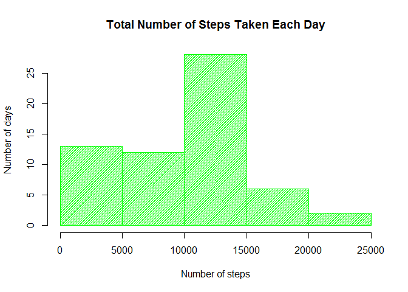
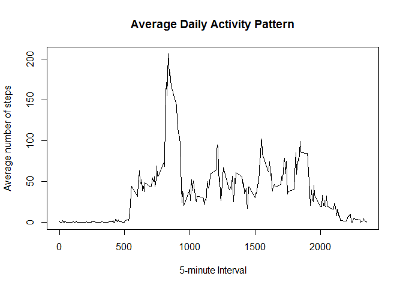
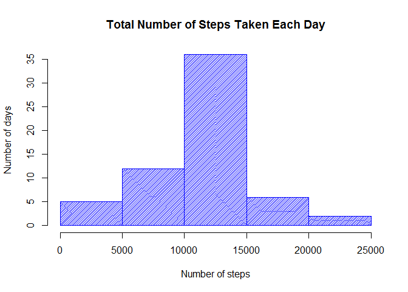
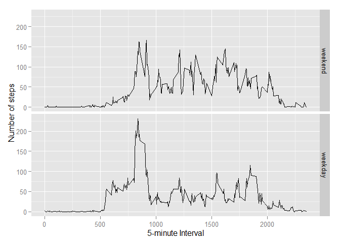

# Reproducible Research: Peer Assessment 1


## Loading and preprocessing the data

1. Load the data (i.e. `read.csv()`)


```r
activity <- read.csv("activity.csv")
```

2. Transform the date variable into Date format:


```r
activity$date <- as.Date(activity$date)
```

## What is the mean total number of steps taken per day?

For this part of the assignment, you can ignore the missing values in the dataset.

1. Make a histogram of the total number of steps taken each day


```r
library(dplyr)

sums <- group_by(activity, date) %>% summarize(steps = sum(steps, na.rm = TRUE))

hist(sums$steps, xlab = "Number of steps", ylab = "Number of days", main = "Total Number of Steps Taken Each Day", col = "green", density = 50)
```

 

2. Calculate and report the mean and median total number of steps taken per day


```r
sums_mean <- mean(sums$steps, na.rm = TRUE)
sums_mean
```

```
## [1] 9354.23
```

```r
sums_median <- median(sums$steps, na.rm = TRUE)
sums_median
```

```
## [1] 10395
```

## What is the average daily activity pattern?

1. Make a time series plot (i.e. `type = "l"`) of the 5-minute interval (x-axis) and the average number of steps taken, averaged across all days (y-axis)


```r
by_interval <- group_by(activity, interval) %>% summarize(steps = mean(steps, na.rm = TRUE))

plot(x = by_interval$interval, y = by_interval$steps, type = "l", xlab = "5-minute Interval", ylab = "Average number of steps", main = "Average Daily Activity Pattern")
```

 

2. Which 5-minute interval, on average across all the days in the dataset, contains the maximum number of steps?


```r
by_interval$interval[which.max(by_interval$steps)]
```

```
## [1] 835
```

## Imputing missing values
Note that there are a number of days/intervals where there are missing values (coded as `NA`). The presence of missing days may introduce bias into some calculations or summaries of the data.

1. Calculate and report the total number of missing values in the dataset (i.e. the total number of rows with `NA`s)


```r
isNA <- which(is.na(activity$steps))

length(isNA)
```

```
## [1] 2304
```

2. Devise a strategy for filling in all of the missing values in the dataset. The strategy does not need to be sophisticated. For example, you could use the mean/median for that day, or the mean for that 5-minute interval, etc.


> Will impute the means of the 5-minute intervals by leveraging the `by_interval` variable generated in the previous section.


3. Create a new dataset that is equal to the original dataset but with the missing data filled in.


```r
activity_noNA <- activity

for(i in 1:length(isNA)){
    activity_noNA$steps[isNA[i]] <- by_interval$steps[by_interval$interval == activity_noNA$interval[isNA[i]]]
}
```

4. Make a histogram of the total number of steps taken each day and Calculate and report the **mean** and **median** total number of steps taken per day. Do these values differ from the estimates from the first part of the assignment? What is the impact of imputing missing data on the estimates of the total daily number of steps?


```r
sums_noNA <- group_by(activity_noNA, date) %>% summarize(steps = sum(steps))

hist(sums_noNA$steps, xlab = "Number of steps", ylab = "Number of days", main = "Total Number of Steps Taken Each Day", col = "blue", density = 50)
```

 

```r
sums_noNA_mean <- mean(sums_noNA$steps)
sums_noNA_mean
```

```
## [1] 10766.19
```

```r
sums_noNA_median <- median(sums_noNA$steps)
sums_noNA_median
```

```
## [1] 10766.19
```

> How the new mean differs from the mean in the first part of the assignment:


```r
sums_noNA_mean - sums_mean
```

```
## [1] 1411.959
```

> How the new median differs from the median in the first part of the assignment:


```r
sums_noNA_median - sums_median
```

```
## [1] 371.1887
```

> The impact of imputing missing data on the estimates of the total daily number of steps was that it made the data more "normal" looking. Specifically, a big part of the left-most tail of the histogram (0 - 5000 steps), where all the NAs were originally counted, transferred over to the middle. In other words, the mean and median increased, which is logical since NAs = 0 were replaced with mean values > 0.

## Are there differences in activity patterns between weekdays and weekends?
For this part the `weekdays()` function may be of some help here. Use the dataset with the filled-in missing values for this part.

1. Create a new factor variable in the dataset with two levels -- "weekday" and "weekend" indicating whether a given date is a weekday or weekend day.


```r
library(chron)

activity_noNA$day <- factor(is.weekend(activity_noNA$date), levels = c(TRUE, FALSE), labels = c("weekend", "weekday"))
```

2. Make a panel plot containing a time series plot (i.e. `type = "l"`) of the 5-minute interval (x-axis) and the average number of steps taken, averaged across all weekday days or weekend days (y-axis).


```r
library(ggplot2)

by_interval_wkday_noNA <- group_by(activity_noNA, interval, day) %>% summarize(steps = mean(steps))

ggplot(by_interval_wkday_noNA, aes(interval, steps)) + geom_line() + facet_grid(day ~ .) + xlab("5-minute Interval") + ylab("Number of steps")
```

 
